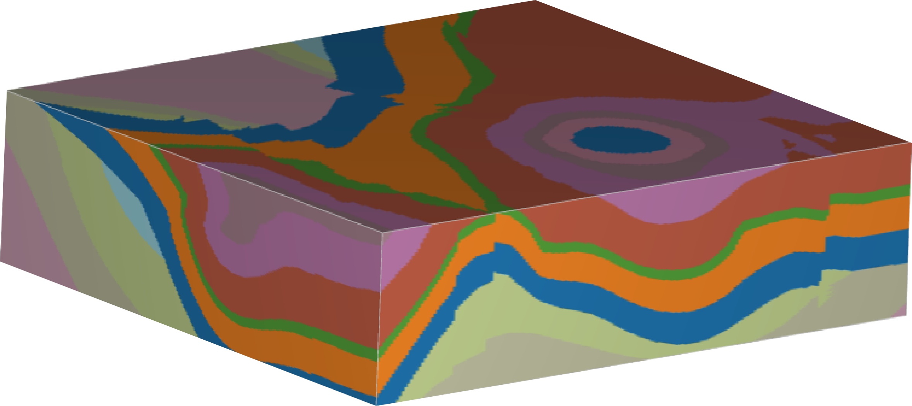

# LoopStructural: Loop3D Implicit Geological Modelling


[](https://badge.fury.io/py/LoopStructural)
[](https://github.com/Loop3D/LoopStructural/blob/master/LICENSE)
[](https://loop3d.github.io/LoopStructural)

## Overview

LoopStructural is an opensource Python library for 3D geological modelling. The library has been built in the scope of the Loop project ([Loop3d.org](https://loop3d.org/)). LoopStructural can:

- Model fault networks integrating fault kinematics and overprinting relationships
- Model folds using structural elements (fold axis, fold axial surface) for multiple fold events
- Use different implicit interpolation algorithms (Finite Difference, Piecewiese Linear, RBF)
- Export models to vtk, geoh5, omf, gocad, csv, obj formats
- Visualise models in an interactive python environment.

## Installation

### Google colab

LoopStructural can be used inside a google colab notebook, however interactive visualisation using kitware trame does not work. Only static plots can be displayed.

### Pip

`pip install loopstructural`

Optional dependencies are:

- loopstructuralvisualisation (wrapper for pyvista to interface with loopstructural objects)
- pyvista (3D visualisation)
- geoh5py (export to .geoh5 format)
- mira-omf (export to .omf format to load in Leapfrog)
- pyevtk
- dill (serialize loop models to a pickle file)
- tqdm (progress bars)
- loopsolver (experimental solver for admm inequality constraints)

You can install all of the optional dependencies using:
`pip install loopstructural[all]`

### conda

`conda install -c conda-forge -c loop3d loopstructural`

to install the working 3D visualisation environment
`conda install -c conda-forge -c loop3d loopstructural loopstructuralvisualisation pyvista trame trame-vtk trame-vuetify`

## Quickstart

- A basic geological model

```Python
from LoopStructural import GeologicalModel
from LoopStructural.datatypes import BoundingBox
from LoopStructural.visualisation import Loop3DView
from LoopStructural.datasets import load_claudius

import numpy as np
data, bb = load_claudius()

#bb constaints origin and maximum of axis aligned bounding box
#data is a pandas dataframe with X,Y,Z,val,nx,ny,nz, feature_name

model = GeologicalModel(bb[0,:],bb[1,:])
model.data = data
# nelements specifies the number of discrete interpolation elements
# 'stratí' is the feature name in the data dataframe
model.create_and_add_foliation('strati',nelements=1e5)
model.update()
# get the value of the interpolator at some random locations
locations = np.array(
    [
        np.random.uniform(bb[0, 0], bb[1, 0],5),
        np.random.uniform(bb[0, 1], bb[1, 1],5),
        np.random.uniform(bb[0, 2], bb[1, 2],5),
    ]
).T
val = model.evaluate_feature_value('strati', locations)
# get the gradient of the interpolator
gradient = model.evaluate_feature_gradient('strati',locations)

#Plot the scalar field of the model
model['strati'].scalar_field().plot()


```

## Documentation

The LoopStructural documentation can be found [here](https://loop3d.github.io/LoopStructural)

## Problems

Any bugs/feature requests/comments please create a new [issue](https://github.com/Loop3D/LoopStructural/issues).

## Acknowledgements

_The Loop platform is an open source 3D probabilistic geological and geophysical modelling platform, initiated by Geoscience Australia and the OneGeology consortium. The project is funded by Australian territory, State and Federal Geological Surveys, the Australian Research Council and the MinEx Collaborative Research Centre._
