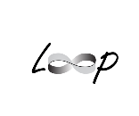

..  LoopStructural documentation master file

The implicit geological modeling engine developed for the Loop consortium with algorithms capable of incorporating structural geology information and data.

.. figure:: images/examples.png
   :alt: examplemodels

.. toctree::
    :maxdepth: 1

    Installation <installation>
    Tutorials <tutorials>
    API Reference: LoopStructural <LoopStructural>

Introduction
~~~~~~~~~~~~

Loop is a new platform (proposed workflow show in the following diagram) that will enable field geologists, researchers from academia and government organisations, explorers, resources modellers & managers to better define their 3D geological environment as well as assessing the requirement for optimised additional data/knowledge acquisition. The platform will be OpenSource, scalable and applicable to problems from the mine scale to the plate scale, in data rich and poor environment. It will serve to solve problems related to urban geology, basins resources exploration and exploitation as well as minerals and scientific exploration in poly-deformed metamorphosed terranes.

Loop is a new platform (proposed workflow show in the following diagram) that will enable field geologists, researchers from academia and government organisations, explorers, resources modellers & managers to better define their 3D geological environment as well as assessing the requirement for optimised additional data/knowledge acquisition. The platform will be OpenSource, scalable and applicable to problems from the mine scale to the plate scale, in data rich and poor environment. It will serve to solve problems related to urban geology, basins resources exploration and exploitation as well as minerals and scientific exploration in poly-deformed metamorphosed terranes.
