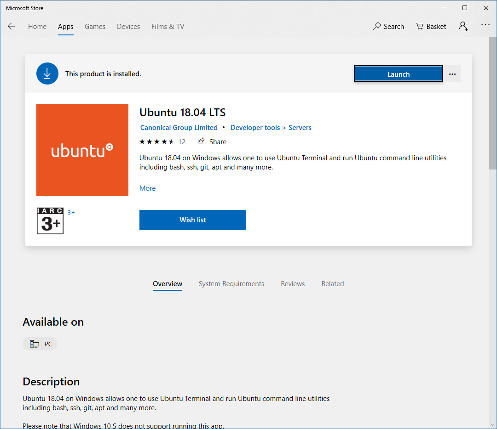
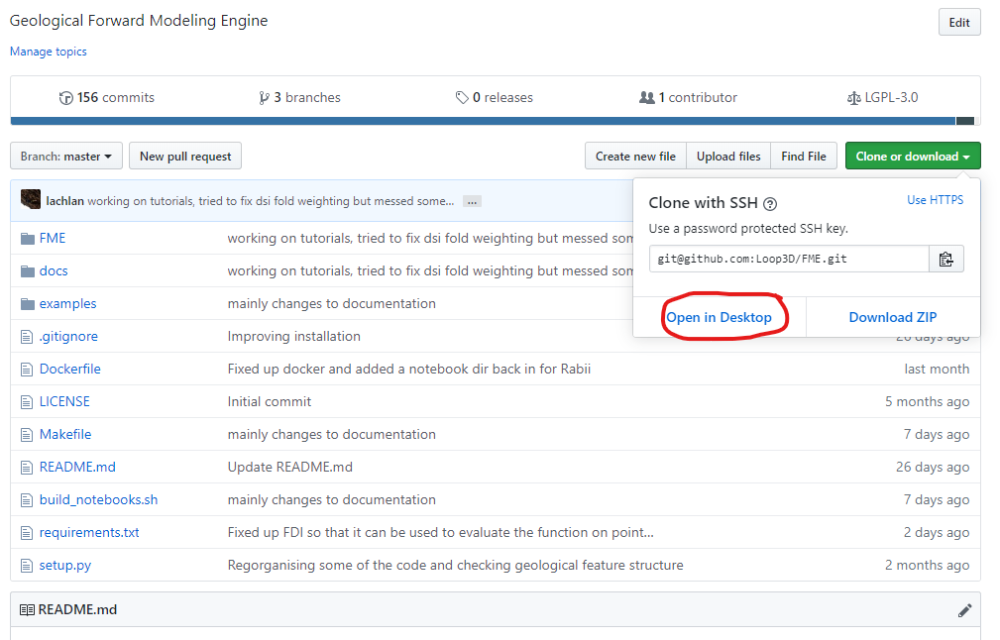
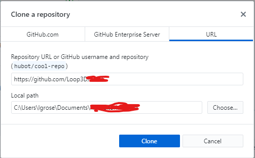
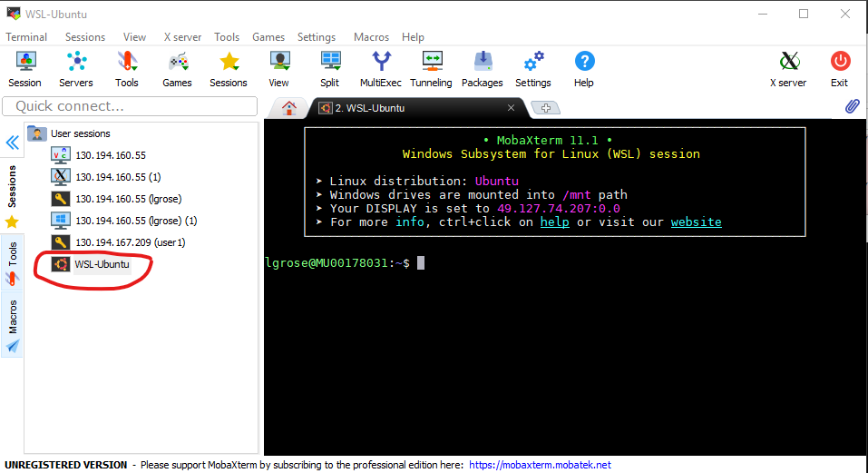

FME Installation
================
FME is a python3 library with a few dependencies. A makefile exists to make the installation process easier on unix systems. 
For a windows use it is recommended to use the `Windows Subsystem for Linux` <https://docs.microsoft.com/en-us/windows/wsl/install-win10> for running WLS or using a docker container.

**Native installation on windows is not recommended** however if you insist on using python natively on windows you can use the anaconda environment linked with a C++ compiler. Final releases of FME will provide compiled wheels that can be installed on conda or pip using windows.

Dependencies
------------
* `meshpy` <https://documen.tician.de/meshpy/installation.html> is used to build tetrahedral meshes
* `lavavu` <https://github.com/lavavu/LavaVu> is used for 3D visualisation
* numpy
* scipy
* scikit-learn
* scikit-image
* meshio
* cython
  
Other useful packages that are used in our examples are:

* matplotlib
* geopandas
* pyvista

Windows
--------

Installing WSL
~~~~~~~~~~~~~~

To setup the windows subsystem for linux you must have administrator rights on your computer.
Open PowerShell as Administrator (right click and choose run as administrator) and run the following command:

.. image:: images/powershell_enable_wls.png

.. code-block:: PowerShell

    Enable-WindowsOptionalFeature -Online -FeatureName Microsoft-Windows-Subsystem-Linux

Once this command has been executed you may need to restart your computer.

When the WSL has been enabled you can use the microsoft store to install a linux operating system.
You can use any operating system you want however, this guide assumes you are using ubuntu 18.04 LTS.

Once you have installed the operating system you will be asked to enter a unix username and password, these do not have
to be the same as windows - but it is important that you remember them.

You should then have access to the linux terminal. Which will look something like below:

.. image:: images/wls_terminal.png

Installing github for desktop
~~~~~~~~~~~~~~~~~~~~~~~~~~~~~

Install a windows github client e.g.:

 * `tortoiseGit` <https://desktop.github.com/>
 * `github dekstop` <https://desktop.github.com/>

Now clone the FME repository from the website by clicked clone and open in desktop.

This will then ask you to input a directory for cloning the respository:

.. code-block::

    C:/Users/{username}/Documents/Repositories/FME

MobaXterm is a terminal client with an X11 server it is best to use this to connect to WLS.
Download `MobaXterm`<https://mobaxterm.mobatek.net/download.html>

Installing FME
~~~~~~~~~~~~~~

Before you install FME the ubuntu package manager should be updated and the installed packages should be upgraded.

Using the linux terminal type in the following commands.
You can paste into the WLS terminal using

.. code-block::

    sudo apt-get update && sudo apt-get upgrade

The dependencies can then be installed:

* python3
* python3-dev
* python3-venv
* pybind11-dev
* mesa-common-dev
* mesa-utils
* libgl1-mesa-dev
* g++
* gcc
* make

.. code-block::

	sudo apt-get update  && sudo apt-get install python3 python3-venv python3-dev make pybind11-dev mesa-common-dev mesa-utils libgl1-mesa-dev gcc g++

It is then recommended to create a new python virtual environment for FME.

`Python Virtual Environments: A primer` <https://realpython.com/python-virtual-environments-a-primer/>

You can create the virtual environment in any location on your computer.

You can change to the directory where FME is located by using the following command.

.. code-block::

    cd /mnt/c/Users/{username}/Documents/Repositories/FME

Remember to change the path to the directory where FME is located on your computer.

You can then create a virtual environment using the following command.
This creates a virtual environment called venv inside the FME repository.
This folder is automatically ignored by git.

.. code-block::

    python3 -m venv venv

You can then create an environment variable for this location by editing your .bashrc file.
Using VIM or your favourite text editor

.. code-block::

    nano ~/.bashrc

Add a line to end end of the file:

.. code-block::

    export FME_ENV=/mnt/c/Users/{username}/Documents/Repository/FME/venv
    alias fme='. $FME_ENV/bin/activate'

The second line creates a command line command for switching to the FME virtual environment.

.. image:: images/edit_bashrc.png

For convenience you can symbolic link folders to the home directory for linux.
This means that the FME folder will appear in the home directory of your linux user.

.. code-block::

    ln -s /mnt/c/Users/{username}/Documents/Repository/FME FME

Now change directory to the home folder for linux using the terminal

.. code-block::

    cd ~

Now change directory into FME

.. code-block::

    cd FME

Now install meshpy using the meshpy.sh script which automates cloning the repository and running the setup.py file.
Make sure the fme environment is activated to run this command.

.. code-block::

    fme
    ./meshpy.sh

You can now install FME using the makefile.

.. code-block::

    make all

This should run the following commands:

.. code-block::

    . ${FME_ENV}/bin/activate  &&
    pip3 install -r requirements.txt &&
    python3 setup.py install build_ext --inplace;

A jupyter notebook server can be run from within the FME folder by running

.. code-block::

    make notebook

.. image:: images/run_jupyter.png

You can then navigate to the jupyter notebook server using your browser.

.. code-block::

    localhost:8888

.. image:: images/jupyter_browser.png

You can now start using FME.
Try working through one of the examples/tutorials found in the notebooks directory.

Upgrading FME
~~~~~~~~~~~~~

If you have already installed FME and want to upgrade to the most recent version.

First pull the most recent version from github.

Using the WSL change to the FME directory and run the makefile

.. code-block::

    cd FME
    make build

This will not install the requirements.txt and only call the setup.py file for FME.

Running FME
~~~~~~~~~~~
To use the model viewing capabilities of LavaVu you need to use MobaXterm or another ssh/terminal client with x forwarding capabilities.
To run the included examples in FME you can simply run

.. code-block::

    make notebook

and then using your web browser navigate to localhost:8888 or whichever port the jupyter notebook server is on.

If you want to run a jupyter notebook server from another directory you must first activate the FME python environment.

.. code-block::

    fme

You can then start a jupyter notebook server

.. code-block::

    jupyter-notebook --no-browser

You can then navigate to localhost:8888 or the port specified.

Linux
-----

FME can be easily installed using a Makefile once a few things are set up. Firstly, you need to add an environment variable to your system. FME_ENV, this can be done by adding `export FME_VENV=$YOUR_PATH_TO_VIRTUAL_ENVIRONMENT` to the `.bashrc` file. Make sure the path is updated to a directory in your system where you want to save the python virtual environment. It could be for example where you clone this repository and a subfolder called venv or fme. 

Once you have the environment variable you can run the command `make dependencies` which will install the required dependencies for FME:

Required dependencies
* pybind11-dev
* mesa-common-dev
* mesa-utils
* libgl1mesa-dev
`sudo apt-get install pybind11-dev mesa-common-dev mesa-utils libl1mesa-dev`

Once these are installed you can run `make venv` to create a new python virtual environment in the location you specified. If a python environment already exists then this will be used.

`make all` will install the required python dependencies for FME and then install and build the library. It just executes the following command: `pip3 install -r requirements.txt && python3 setup.py install build_ext --inplace`

If you want to use a jupyter notebook then you can launch a server by running `make notebook`, alternatively you can run `make notebookbuild` if you want to build the library before launching the server.

If you want to compile the example files into jupyter notebooks you can do this using the `p2j` package. This can be done by running `make compileexamples`

